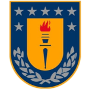
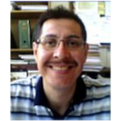

# About us

4GlobalSustainability is a Network of Institutions (formal and non-formal), Companies and Professionals with different interests (environmental, social, economic, environmental, technological, strategic) around sustainability and issues of digital transformation and industry 4.0.

# Collaboration model

## Institutions
|UdeC|
|---|
||

## Companies

## Professionals and people
|Equipo|
|---|---|---|---|
||**Phd (c) M.Sc. Gustavo Godoy U.**, School of Sciences and Technologies. Department of Geodetic and Geomatics Sciences. University of Concepción Campus Los Angeless||

